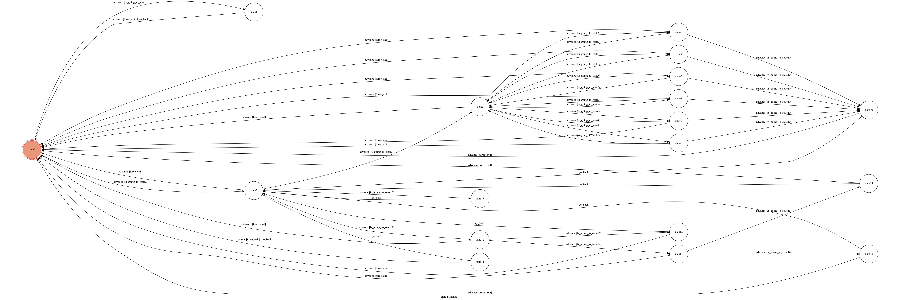

# feeding chicken

## Install 
pip install -r requirements.txt

## EXECUTE
1. open ngrok as gate (at socket 5000)
 > ./ngrok http 5000
2. run app.py code (under python3)
 > python3 app.py

## FSM
* 

## screenshot

## desctiption
### start
* input **/start** at begining
### in-game
* follow the instruction in []
* e.g. when u see : [15] 玩遊戲
       input: 15 
### TERMINATED
* at any time when u want to exit the current game input **/exit** 

## state detail
+---+---+
| state |  description |
