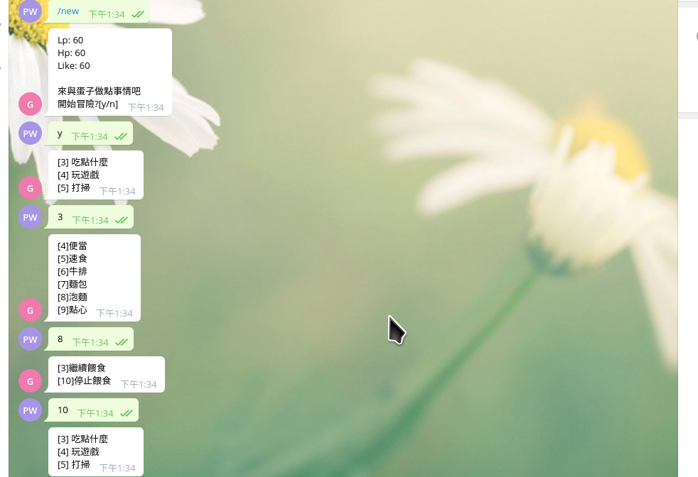

# TAMAGOCHI - the electrical chicken

## Install 
pip install -r requirements.txt

## EXECUTE
1. fill out your [API_TOKEN] & [WEBHOOK_URL] in **app.py** (line 12, 13)
2. open ngrok as gate (at socket 5000)
 > ./ngrok http 5000
3. run app.py code (under python3)
 > python3 app.py

## FSM
* 

## screenshot

## desctiption
### start
* input **/start** at begining
### in-game
* follow the instruction in []
* e.g. when u see : [15] 玩遊戲
       input: 15 
### TERMINATED
* at any time when u want to exit the current game input **/exit** 

## state detail
| state |  description |
|---|---|
| state0 | initail |
| state1 | introduce |
| state2 | option |
| state3 | optoin A (eat) |
| state4 | 便當 |
| state5 | 速食 |
| state6 | staek |
| state7 | bread |
| state8 | instant noodle |
| state9 | snack |
| state10 | check state | 
| state11 | DIE |
| state12 | option C |
| state13 | sleep | 
| state14 | cell phone |
| state15 | fb |
| state16 | google |
| state17 | joke |
